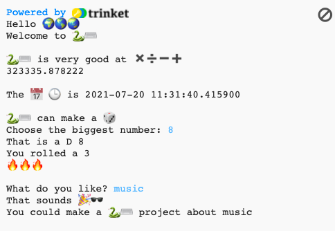

## Hello World

Open the [Hello 🌍🌎🌏 starter project](https://carrot-cake-proto.herokuapp.com/python/python-hello-starter){:target="_blank"}. Trinket will open in another browser tab.

--- no-print ---
--- task ---
### Try it

  
Read the output and then tap <kbd>Enter</kbd> to continue. 
Type in your answers to the questions. Can you see how your answers are used?

  <iframe src="https://carrot-cake-proto.herokuapp.com/embed/viewer/python-emoji-example" width="600" height="500" frameborder="0" marginwidth="0" marginheight="0" allowfullscreen>
  </iframe>
  

--- /task ---
--- /no-print ---

--- print-only ---

--- /print-only ---
